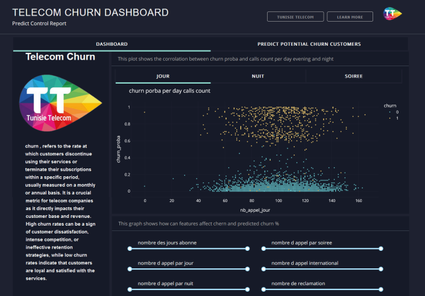
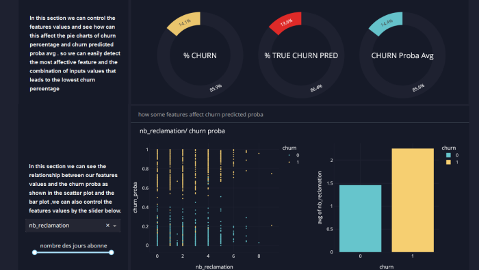
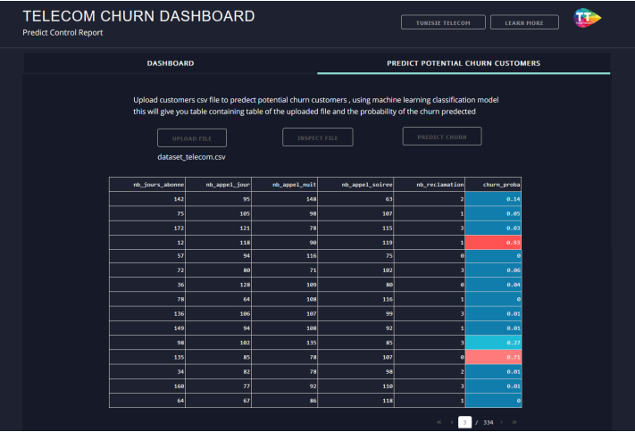

# Customer Churn Prediction at Tunisie Télécom

## Project Overview

This project is part of a mandatory summer internship for the first-year engineering cycle in Data Science at the Faculty of Sciences of Tunis. The internship was conducted at Tunisie Télécom, the leading telecommunications operator in Tunisia.

## Problem Statement

Tunisie Télécom offers a wide range of services to meet the needs of its customers. However, despite the variety of services, some customers are dissatisfied and have decided to terminate their subscriptions, switching to competing operators. This churn is a critical issue as it leads to a decrease in revenue and market share. Key reasons for customer churn include high call costs, network coverage issues, and unsatisfactory customer service. These factors influence customers' decisions to choose another operator.

## Proposed Solution

To address the churn problem, Tunisie Télécom aims to develop methods to predict customer attrition, as the cost of acquiring a new customer is often higher than retaining an existing one. The proposed solution involves developing a churn prediction model using various supervised learning algorithms. The objective is to select the best model based on its accuracy in predicting customer churn by analyzing historical customer data. The results of the prediction and model performance will be visualized. The most effective prediction model will then be integrated into a simple and user-friendly web page.

## Project Objectives

- **Data Collection and Preprocessing:** Gather and preprocess historical customer data to prepare it for model training.
- **Model Development:** Develop and evaluate multiple supervised learning algorithms to predict customer churn.
- **Model Evaluation:** Compare models based on their accuracy and select the best-performing model.
- **Web Integration:** Integrate the chosen prediction model into a simple web interface for ease of use by Tunisie Télécom.

## Demo

Below are some demo images :

### 1. Dashboard

### 2. Prediction page

## Prerequisites

- Python 3.x
- Pandas
- Scikit-learn

## Installation

Ensure you have the necessary dependencies installed. You can install them using `pip`:

